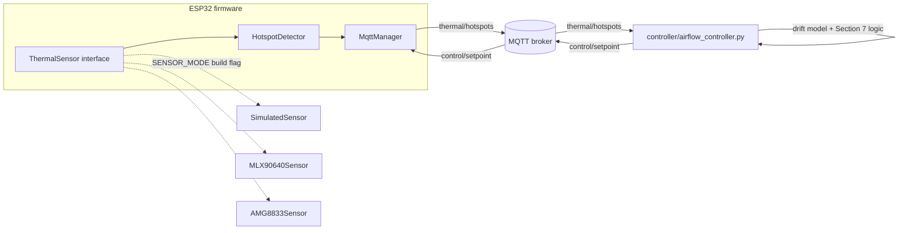

# Thermal Vision-Based Intelligent Airflow Optimization

ESP32 + thermal-camera (MLX90640 or AMG8833) HVAC controller. Software-complete
and validated in simulation before any hardware purchase; now built and
confirmed working end-to-end on real hardware -- AMG8833 sensing, hotspot
detection, pan+tilt servo tracking, and the ILI9341 live heatmap display all
verified live (`docs/build-guide.md`). Swapping in real hardware required zero
logic changes -- only swapping the sensor implementation behind one interface
(`ThermalSensor`).

Wireless re-flash (ArduinoOTA) is available once the board's joined WiFi --
`pio run -e esp32dev_amg8833_ota -t upload --upload-port <esp32-ip>` -- so
further iteration doesn't need the USB cable after the first flash.

See `PROJECT_PLAN.md` for the full spec this repo implements. Every number
below comes from a script's own printed output -- see `docs/results.md` for
exact commands.

## Validated Results

Last full re-verification pass, every script/test re-run from scratch:

| Check | Result | Key numbers |
|---|---|---|
| `simulation/thermal_dynamics_sim.py` | PASS | sanity check only, no numeric claim tracked in `docs/results.md` |
| `simulation/hotspot_accuracy_eval.py` | PASS | MLX90640: precision=0.997 recall=0.678 f1=0.807; AMG8833: precision=1.000 recall=0.536 f1=0.698 |
| `ml/train_drift_model.py` | PASS | Test MAE=0.1566 deg C, RMSE=0.2344 deg C |
| `simulation/energy_simulation.py` | PASS | mean=24.00% std=9.60% reduction (20 seeds); comfort MAE static=0.522 deg C, predictive=0.999 deg C |
| `simulation/mqtt_integration_test.py` | PASS | 20/20 setpoint decisions, exit code 0 |
| `pio run -e esp32dev` (firmware) | PASS | RAM 17.3%, Flash 60.4% |

**This does not clear the ~90% accuracy claim from PROJECT_PLAN.md section 0.**
Precision is excellent (99.7-100%: almost no false alarms), but recall is
0.54-0.68, pulling F1 to 0.70-0.81. Root cause: the synthetic generator's low
end (~2C above ambient) produces blobs genuinely below or barely at the
detection threshold (3.5-4.5C) by construction -- those are correctly missed,
not detector bugs. Real occupant hotspots (skin ~33C vs. ~24C ambient, an
~9C delta) sit well clear of threshold, so this eval's recall is likely a
pessimistic floor rather than a realistic field number, but that's a
hypothesis, not something re-measured here. Per PROJECT_PLAN.md's own
instruction, the measured numbers are reported as-is rather than re-tuned to
hit ~90%.

Full detail, exact commands, and methodology: `docs/results.md`.

## Architecture



Data flow and component responsibilities are detailed in
`docs/architecture.md`.

## Repo layout

```
simulation/    thermal dynamics, hotspot detection, energy sim, MQTT integration test
ml/            NumPy drift-forecasting MLP + training
controller/    airflow_controller.py: MQTT -> drift model -> setpoint
firmware/      PlatformIO ESP32 project (SENSOR_MODE = SIM | MLX90640 | AMG8833)
docs/          architecture, setup, results, hardware BOM
```

## Running everything in simulation today

```bash
pip install -r requirements.txt

python3 simulation/thermal_dynamics_sim.py      # sanity-check the dynamics model
python3 simulation/hotspot_accuracy_eval.py     # hotspot precision/recall/F1
python3 ml/train_drift_model.py                 # train the drift MLP, prints test MAE
python3 simulation/energy_simulation.py         # static vs predictive energy comparison
python3 simulation/mqtt_integration_test.py     # in-process amqtt broker, end-to-end check

cd firmware && pio run -e esp32dev              # compile-check firmware (SIM build)
```

Full command reference and expected output: `docs/setup.md`.

## Switching to real hardware

Done for the AMG8833 build -- see `docs/build-guide.md` for the full
assembly/bring-up walkthrough and `docs/hardware-bom.md` for parts. Short
version:

1. Wire up the MLX90640 or AMG8833 breakout (I2C) to the ESP32.
2. Build with `pio run -e esp32dev_amg8833_demo` (real sensor, radio off --
   what the physical demo runs on) or `pio run -e esp32dev_amg8833`
   (real sensor + WiFi/MQTT) instead of the default `esp32dev` (SIM)
   environment. `esp32dev_mlx90640` exists too but is untested on real
   MLX90640 hardware -- only AMG8833 has been physically wired and run.
3. Fill in real WiFi/MQTT broker settings in `firmware/include/config.h` if
   using the networked build.

No change to `HotspotDetector`, `MqttManager`, `main.cpp`, or anything on the
Python side -- they only ever talk to the `ThermalSensor` interface.

Two ILI9341 clone quirks worth knowing before wiring one up (both already
fixed in `HeatmapDisplay.cpp`, documented here so a driver swap doesn't
silently reintroduce them): the panel corrupts its own GRAM under
`setRotation(1)` regardless of wiring or power -- `rotation(3)` at a reduced
20MHz SPI clock is what's clean on this board -- and the AMG8833's row order
needed a software flip to match real-world up/down without touching that
rotation register.

## Status vs. resume claims

- ~90% hotspot-detection accuracy: measured precision is 0.997-1.000, but
  measured recall (0.54-0.68) and F1 (0.70-0.81) come in below ~90% in this
  eval -- see `docs/results.md` for the real numbers and why.
- ~25% lower simulated energy use: measured 24.00% mean (std 9.60%) across
  20 seeds -- matches.
