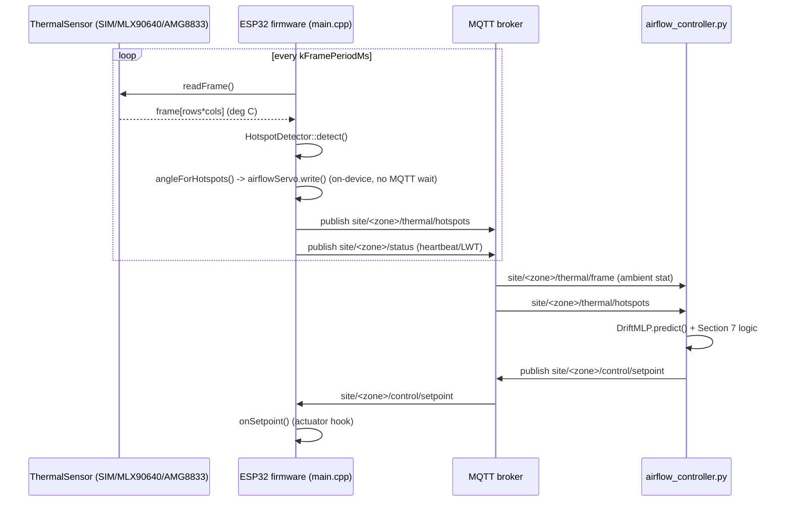

# Architecture

## Data flow



## Components

| Component | File(s) | Responsibility |
|---|---|---|
| `ThermalSensor` | `firmware/src/ThermalSensor.h` | Abstract interface (`begin`, `readFrame`, `rows`, `cols`). Everything downstream only talks to this. |
| Sensor implementations | `firmware/src/{Simulated,MLX90640,AMG8833}Sensor.{h,cpp}` | One concrete implementation each, selected at compile time via `SENSOR_MODE`. Only one is compiled into a given build (the other two are `#if`-guarded to empty translation units). |
| `HotspotDetector` (C++) | `firmware/src/HotspotDetector.{h,cpp}` | Median-threshold + iterative BFS flood fill, exact port of `simulation/hotspot_detector.py`. Runs on-device. |
| `hotspot_detector.py` | `simulation/hotspot_detector.py` | Python reference implementation of the same algorithm, used for the accuracy eval and any future prototyping. |
| `thermal_scene_simulator.py` | `simulation/thermal_scene_simulator.py` | Generates synthetic frames + ground-truth blob positions for accuracy eval. |
| `hotspot_accuracy_eval.py` | `simulation/hotspot_accuracy_eval.py` | Runs N synthetic frames through the detector, scores precision/recall/F1 against ground truth. |
| `MqttManager` | `firmware/src/MqttManager.{h,cpp}` | Wraps PubSubClient: publishes hotspots/status, subscribes to control/setpoint, handles LWT/reconnect. |
| `thermal_dynamics_sim.py` | `simulation/thermal_dynamics_sim.py` | Single source of truth for the room thermal ODE (outside heat exchange, occupant gain, HVAC cooling, noise). Reused by both the ML training data generator and the energy sim. |
| `DriftMLP` | `ml/thermal_drift_model.py` | Pure-NumPy one-hidden-layer MLP: forward/backward/train_step, JSON weight (de)serialization. |
| `train_drift_model.py` | `ml/train_drift_model.py` | Generates training data from randomized simulated days, trains `DriftMLP`, reports held-out test MAE, saves weights + normalization stats. |
| `energy_simulation.py` | `simulation/energy_simulation.py` | Runs the static bang-bang thermostat and the predictive controller over identical randomized days, reports mean/std energy reduction. |
| `airflow_controller.py` | `controller/airflow_controller.py` | Production-shaped version of the predictive controller: subscribes to live MQTT topics, loads the trained model, publishes control/setpoint decisions. |
| `mqtt_integration_test.py` | `simulation/mqtt_integration_test.py` | Spins up an in-process `amqtt` broker, drives a simulated publisher, and confirms the controller reacts end-to-end. |
| `angleForHotspots` / `airflowServo` | `firmware/src/main.cpp` | On-device airflow-direction reflex: maps the strongest detected hotspot's column to a servo angle (`config.h` `kServoPin`) every frame. Independent of the MQTT round-trip -- doesn't wait on `airflow_controller.py`. |
| `HeatmapDisplay` | `firmware/src/HeatmapDisplay.{h,cpp}` | On-device live visualization: renders the current frame as a false-color heatmap with hotspot markers on a 2.4" ILI9341 SPI TFT, every frame. Purely visual -- reads the same frame/hotspot data `main.cpp` already computed, doesn't feed back into detection or control. |

## Two actuation paths, two timescales

There are deliberately two separate actuation mechanisms, not one:

- **Airflow direction** (fast, on-device): `main.cpp` computes a servo angle
  from the current frame's strongest hotspot and writes it immediately, every
  `kFramePeriodMs`. No network dependency -- this keeps working even if
  WiFi/MQTT is down.
- **Temperature setpoint** (slower, host-side): `airflow_controller.py`
  combines the drift forecast with occupancy to decide `setpoint_c` /
  `cooling_level`, published back over MQTT to `onSetpoint()`. This is where
  a relay/compressor interface would eventually plug in (not yet wired --
  see `docs/hardware-bom.md`).

## On-device outputs

Every frame, `main.cpp` drives three local outputs directly from
`HotspotDetector`'s result -- none of them wait on MQTT or the host-side
controller:

- **Heartbeat/hotspot LEDs** (`kHeartbeatLedPin`/`kHotspotLedPin`): cheap
  at-a-glance status.
- **Airflow-direction servo** (`airflowServo`): see "Two actuation paths"
  below.
- **Live heatmap display** (`heatmapDisplay.render(...)`): a false-color
  rendering of the raw frame plus hotspot markers on the ILI9341 TFT --
  makes the sensor data and detector output visible in real time, which is
  otherwise only inferable from LED blinks or Serial logs.

## Sensor abstraction and hardware swap-in

`SENSOR_MODE` is a PlatformIO build flag (`SENSOR_MODE_SIM` /
`SENSOR_MODE_MLX90640` / `SENSOR_MODE_AMG8833`), set per-environment in
`firmware/platformio.ini`. `main.cpp` picks the concrete sensor type via
`#if defined(SENSOR_MODE_...)` at compile time and instantiates exactly one
global `sensor` object; every other file (`HotspotDetector`, `MqttManager`)
only sees the `ThermalSensor` interface. Swapping hardware later means
building a different PlatformIO environment -- no source changes anywhere
else.

## MQTT topic design (section 8)

```
site/<zone>/thermal/frame       downsampled frame stat, e.g. {"ambient_c": float}
site/<zone>/thermal/hotspots    [{"row", "col", "peak_temp_c"}, ...]
site/<zone>/control/setpoint    {"setpoint_c", "cooling_level", "occupancy_count", "predicted_temp_c"}
site/<zone>/status              heartbeat / last-will-and-testament
```
